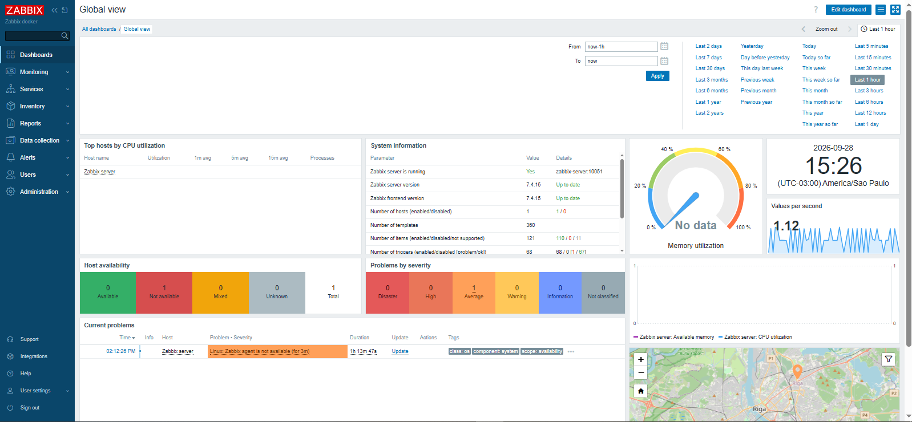
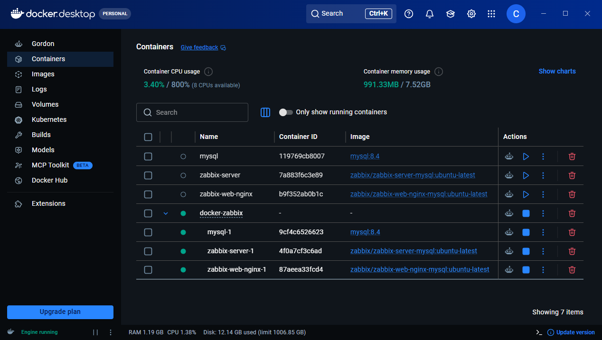

# Zabbix com Docker

Projeto de estudo para executar o Zabbix utilizando containers separados para **MySQL, Zabbix Server e Zabbix Web**, praticando Docker Networking, volumes, variáveis de ambiente e Docker Compose.

## Arquitetura

```text
                  ┌──────────────────┐
                  │   Zabbix Web     │
                  │     + Nginx      │
                  └────────┬─────────┘
                           │
                           ▼
                  ┌──────────────────┐
                  │  Zabbix Server   │
                  └────────┬─────────┘
                           │
                           ▼
                  ┌──────────────────┐
                  │      MySQL       │
                  └──────────────────┘

                 Docker Network
                    zabbix-nt
```

## Recursos

* **MySQL 8.4**
* **Zabbix Server**
* **Zabbix Web + Nginx**
* Docker Network: `zabbix-nt`
* Volume para persistência do MySQL
* Docker Compose

## Configuração inicial

Foram criados:

* Volume `mysql-bd` para armazenamento dos dados do MySQL.
* Network `zabbix-nt` para comunicação entre os containers.
* Container MySQL com usuário `zabbix`.
* Container Zabbix Server conectado ao MySQL.
* Container Zabbix Web/Nginx conectado ao Zabbix Server e ao MySQL.
* Port mapping 8080:8080

## Problemas encontrados

### 1. Credenciais antigas no volume

O Zabbix Server não conseguia acessar o banco utilizando o usuário `zabbix`.

**Causa:** o volume do MySQL continha dados de uma execução anterior, com configurações diferentes.

**Solução:** recriação do volume para inicializar o MySQL com as novas credenciais.

### 2. Permissão para criação do banco

O Zabbix Server apresentou:

```text
ERROR 1044 (42000): Access denied for user 'zabbix'@'%' to database 'zabbix'
```

Foi necessário garantir a criação do banco e as permissões do usuário:

```sql
CREATE DATABASE zabbix
CHARACTER SET utf8mb4
COLLATE utf8mb4_bin;

GRANT ALL PRIVILEGES ON zabbix.* TO 'zabbix'@'%';

SET GLOBAL log_bin_trust_function_creators = 1;
```

No Docker Compose, o parâmetro também pode ser configurado no MySQL:

```yaml
command:
  - --log-bin-trust-function-creators=1
```

### 3. Incompatibilidade de versão do MySQL

O Zabbix apresentou erro informando que a versão do MySQL era superior à suportada.

Foi utilizado o **MySQL 8.4**, compatível com a versão do Zabbix utilizada no projeto.

## Docker Compose

```yaml
networks:
  zabbix-nt:

services:

  mysql:
    image: mysql:8.4
    command:
      - --log-bin-trust-function-creators=1
    environment:
      MYSQL_ROOT_PASSWORD: 8142
      MYSQL_USER: zabbix
      MYSQL_PASSWORD: zabbix
      MYSQL_DATABASE: zabbix
    networks:
      - zabbix-nt

  zabbix-server:
    image: zabbix/zabbix-server-mysql:ubuntu-latest
    init: true
    depends_on:
      - mysql
    environment:
      DB_SERVER_HOST: mysql
      MYSQL_USER: zabbix
      MYSQL_PASSWORD: zabbix
    networks:
      - zabbix-nt

  zabbix-web-nginx:
    image: zabbix/zabbix-web-nginx-mysql:ubuntu-latest
    depends_on:
      - mysql
    environment:
      DB_SERVER_HOST: mysql
      MYSQL_USER: zabbix
      MYSQL_PASSWORD: zabbix
      ZBX_SERVER_HOST: zabbix-server
      PHP_TZ: America/Bahia
    networks:
      - zabbix-nt
    ports:
      - "8080:8080"
```

## Resultado

Zabbix executado com **serviços separados em containers**, utilizando uma Docker Network para comunicação entre os componentes e MySQL como banco de dados.



